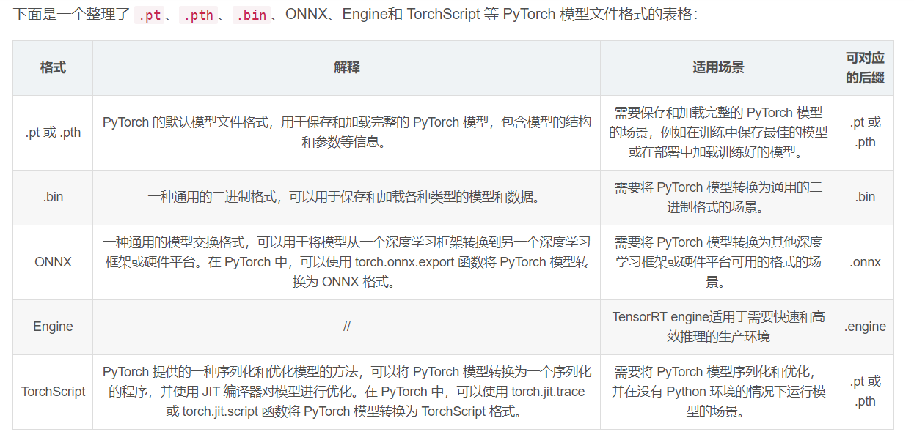

# PyTorch模型中的safetensors文件和bin文件区别

## safetensors文件

格式：safetensors是PyTorch框架中的一种文件格式，用于安全地保存和加载张量数据。
用途：它通常用于存储模型的权重和其他参数，确保数据在保存时不会丢失精度，并且在不同的系统和设备之间具有更好的兼容性。
特点：safetensors格式的文件可能包含了一些额外的元数据，用于验证数据的完整性和一致性。

## bin文件

格式：bin是一种通用的二进制文件格式，它可以被用来存储各种类型的数据，包括但不限于模型权重。
用途：在PyTorch中，.bin文件通常与模型的配置文件一起使用，用于保存和加载预训练模型的权重。
特点：bin文件不特定于PyTorch，它不包含用于验证的元数据，因此在跨平台使用时可能需要额外的处理来确保兼容性和数据的正确性。


## 结论


主要区别：safetensors文件是PyTorch特有的，更注重数据的安全性和兼容性；而bin文件是一种更通用的二进制格式，可能用于多种不同的应用场景。
在PyTorch模型中的使用：两者都可以用来保存模型参数，但safetensors可能提供了更多关于数据安全和校验的特性。
区别bin文件和pth文件

1. 文件格式
   .bin文件：通常是一个二进制格式的文件，它不特定于PyTorch，并可以用于存储任何类型的二进制数据。在机器学习中，.bin文件有时用于保存模型权重，但这并不是一个由PyTorch强制的标准。
   .pth文件：是PyTorch特有的文件扩展名，通常用于保存模型的状态字典（state_dict），也可以用于保存整个模型。
2. 通用性
   .bin文件：由于是通用的二进制格式，它不仅可以在PyTorch中使用，还可以在其他框架或自定义程序中使用。
   .pth文件：更具体地与PyTorch相关，通常表示该文件是使用PyTorch的API创建和预期使用的。
3. 期望内容
   .bin文件：没有特定的期望内容，它可以包含任何二进制数据。如果在PyTorch中使用，需要确保你知道如何正确地解析文件中的内容。
   .pth文件：通常期望包含PyTorch模型的状态字典，或者是保存整个模型对象的序列化形式。
4. 兼容性和移植性
   .bin文件：可能需要额外的处理才能在不同的系统或框架中使用。
   .pth文件：由于它是与PyTorch紧密关联的，通常可以在不同的系统上使用PyTorch进行加载而不需要额外的处理。
   结论
   文件用途：.bin文件可以用于多种用途，包括但不限于保存模型权重，而.pth文件在PyTorch中通常用于保存模型的状态字典或整个模型。
   框架关联：.pth文件与PyTorch框架紧密相关，而.bin文件更通用。
   加载方式：加载.bin文件可能需要自定义的解析方法，而.pth文件可以直接通过PyTorch的torch.load函数加载。
   在PyTorch中，不论是保存为.bin还是.pth，重要的是保存的内容和加载时的兼容性。通常情况下，使用.pth作为文件扩展名是PyTorch社区中的一个约定俗成的做法。

# 加载和保存safetensors文件

保存safetensors文件
import torch # 假设model是一个PyTorch模型实例 model = ... # 保存模型的参数 torch.save(model.state_dict(), 'model_safetensors.pth', _use_new_zipfile_serialization=True)

加载safetensors文件

加载模型的参数 model.load_state_dict(torch.load('model_safetensors.pth'))

# 加载和保存bin文件

保存bin文件

假设model是一个PyTorch模型实例 model = ... # 保存模型的参数 torch.save(model.state_dict(), 'model_weights.bin')

加载bin文件

加载模型的参数 model.load_state_dict(torch.load('model_weights.bin'))

# 结论

保存：无论是safetensors文件还是bin文件，都可以使用torch.save函数来保存PyTorch模型的参数。对于safetensors，可以通过指定_use_new_zipfile_serialization=True参数来确保使用新的zipfile序列化格式。
加载：同样地，两种文件格式都可以使用torch.load函数来加载，然后使用模型的load_state_dict方法将参数加载到模型中。
在实际操作中，应确保保存和加载时使用相同的文件格式，以避免兼容性问题。此外，当涉及到跨平台或者长期存储时，使用safetensors格式可能更为安全可靠。

# 保存.pth文件

使用torch.save()函数保存模型的状态字典
import torch # 假设model是你的PyTorch模型 model = ... # 保存模型的状态字典 torch.save(model.state_dict(), 'model.pth')

使用torch.save()函数保存整个模型

保存整个模型 torch.save(model, 'model_complete.pth')

# 加载.pth文件

加载模型的状态字典

假设model是你的PyTorch模型的一个实例 model = ... # 加载状态字典 model.load_state_dict(torch.load('model.pth')) # 确保在评估模式下使用模型，关闭Dropout等 model.eval()

加载整个模型

加载整个模型 model = torch.load('model_complete.pth') # 确保在评估模式下使用模型，关闭Dropout等 model.eval()

# 注意事项

在加载模型的状态字典时，你需要先有一个与保存的模型架构相同的模型实例。
当保存整个模型时，PyTorch会保存模型的架构以及状态字典。但这种方式可能在跨平台或在不同的环境中存在兼容性问题，因为模型的保存是依赖于具体的类定义的。
在加载模型之后，通常将模型设置为评估模式 (model.eval())，这对于进行预测或评估模型性能是必要的，因为某些层（如Dropout和BatchNorm）在训练和评估时的行为不同。
如果你在一个不同的环境中加载模型，确保所有自定义的类和方法都已经定义，以便PyTorch能够正确地重建模型。
在保存和加载模型时，如果你使用的是GPU，可能需要在torch.load时添加map_location参数，以指定模型应该加载到哪个设备上。

# 备注：

整个模型与模型状态字典的区别

1. 整个模型（Full Model）
   定义：保存整个模型包括了模型的架构信息和参数权重。这意味着你可以在没有原始模型定义的情况下重建整个模型。
   保存内容：模型的类定义、结构和状态字典（包括所有参数和缓存）。
   优点：
   保存和加载简单，只需一行代码。
   可以在没有原始模型代码的情况下加载模型。
   缺点：
   保存的模型文件通常较大。
   保存的模型与Python版本和PyTorch版本紧密绑定，可能存在兼容性问题。
   对于安全性和模型的版本控制不够理想，因为它保存了代码。
2. 模型状态字典（Model State Dict）
   定义：模型状态字典是一个包含模型参数的字典对象。它只保存参数（如权重和偏置），不包括模型的架构。
   保存内容：模型的参数，即权重和偏置等。
   优点：
   文件大小较小，因为只包含参数值。
   更加灵活，可以用于参数的初始化、迁移学习等。
   更容易进行版本控制，因为不包含模型架构和额外的代码。
   兼容性更好，因为它不依赖于模型的具体类定义。
   缺点：
   需要原始模型的代码来定义模型架构，然后才能加载状态字典。
   加载模型时需要更多的步骤，如创建模型实例、加载状态字典等。
   结论
   选择使用哪种方式取决于具体需求：如果需要在不同的环境中灵活地重用模型参数，或者进行模型的迁移学习，通常推荐使用模型状态字典。如果需要简单地在完全相同的环境中分享或迁移整个模型，可以选择保存整个模型。
   推荐使用状态字典进行保存和加载：由于其灵活性和较好的兼容性，通常推荐使用状态字典来保存和加载模型。这样可以确保模型的核心参数能够被正确地应用于相同或修改后的架构中。
   ————————————————

                        版权声明：本文为博主原创文章，遵循 CC 4.0 BY-SA 版权协议，转载请附上原文出处链接和本声明。
原文链接：https://blog.csdn.net/baoyan2015/article/details/135926926


# pytorch在cann上的性能调优流程


在计算越来越重要的今天，以GPU（Graphics Processing Unit）和NPU（Neural Network Processing Unit）为代表的并行计算设备，在人工智能和其他行业，都扮演着重要角色。计算的效率，或者称之为计算的性能，越来越得到广泛关注。

本章节以性能的含义以及性能工具等基础概念介绍为出发点，介绍了训练模型在昇腾设备上的通用性能调优方法。对应的性能调优流程如[图1](https://www.hiascend.com/document/detail/zh/Pytorch/60RC2/ptmoddevg/trainingmigrguide/performance_tuning_0001.html#ZH-CN_TOPIC_0000001986427113__fig15173104172)所示。

[]()[]()**图1 **性能调优流程图


# 保存模型

**更新时间：2024/07/18**

PyTorch在训练过程中，通常使用torch.save()来保存Checkpoint文件，根据模型文件的后续用途会保存为两种格式的模型文件（pth文件和pth.tar文件），以便用于在线推理。

**说明*** 在昇腾PyTorch1.11.0版本中，NPU模型在使用torch.save()进行存储的时候会保存NPU特有的设备信息和数据格式，以便于更好的支持断点训练，这使得保存的pth、pt和pth.tar扩展名文件存在跨平台兼容性问题。为了支持NPU训练出的模型权重或模型可以跨平台使用，需要在模型存储前将模型或tensor放在CPU上进行存储，示例如下：

  ```
  # 将模型放置在cpu上 
  model = model.cpu()  
  ```
* PyTorch2.1.0及以后版本已支持跨设备读取权重，不需要模型或tensor放在CPU上进行存储。
* .pth或.pt扩展名的文件：用于在线推理或导出ONNX格式模型。仅保存模型参数，不保存模型结构，以便压缩文件的体积，可以用Netron等可视化工具打开，样例如[图1](https://www.hiascend.com/document/detail/zh/Pytorch/60RC2/ptmoddevg/trainingmigrguide/PT_LMTMOG_0033.html#ZH-CN_TOPIC_0000001952787004__fig108322851411)所示。
  []()[]() **图1 ** **.pth文件**
  
  通过state_dict来保存和加载模型。
  保存模型，示例如下：

  ```
  # 创建保存路径
  PATH = "state_dict_model.pt"
  # 保存模型
  torch.save(net.state_dict(), PATH)
  ```
  加载模型以用于在线推理，示例如下：

  ```
  # 模型文件保存路径
  PATH = "state_dict_model.pt"
  model = TheModelClass(*args, **kwargs)        #根据实际模型定义填写函数和参数
  # 加载模型
  model.load_state_dict(torch.load(PATH))
  model.eval()
  ```
  **须知**

  保存为后缀是.pth/.pt的文件时，需要提供模型定义文件，否则后续模型无法部署。
* .pth.tar扩展名的文件：可用于在线推理或重新加载后继续训练。文件中保存了多个组件，以字典形式保存。常见的组件包括模型和优化器的state_dict、停止时的epoch、最新记录的训练损失以及外部的torch.nn.Embedding层等。如果仅用于部署推理模型，推荐只在.pth.tar扩展名的文件中保存权重信息即模型的state_dict。
  []()[]()保存模型，示例如下：

  ```
  PATH = "checkpoint.pth.tar"
  torch.save({
      'epoch': epoch,
      'loss': loss,
      'state_dict': model.state_dict(),
      'optimizer' : optimizer.state_dict(),
      ...
  }, PATH)
  ```
  加载模型用于推理或恢复训练，示例如下：

  ```
  model = TheModelClass(*args, **kwargs)            #根据实际模型定义填写函数和参数
  optimizer = TheOptimizerClass(*args, **kwargs)    #根据实际优化器填写函数和参数

  checkpoint = torch.load(PATH)
  model.load_state_dict(checkpoint['model_state_dict'])
  optimizer.load_state_dict(checkpoint['optimizer_state_dict'])
  epoch = checkpoint['epoch']
  loss = checkpoint['loss']

  model.eval()
  # - or -
  model.train()
  ```
  **须知**

  通常情况下，训练图和推理图中对同一个算子处理方式不同（例如BatchNorm和dropout等算子），在输入格式上也有差别。因此在运行推理或导出ONNX模型之前，必须调用 **model.eval()** 来将dropout和batch normalization层设置为推理模式。


# 导出ONNX模型

**更新时间：2024/07/18**


模型训练完成后，用户可以使用pth文件和pth.tar文件导出ONNX模型，然后通过ATC工具将其转换为适配昇腾AI处理器的.om文件用于离线推理。将ONNX模型转换为适配昇腾AI处理器的.om文件流程请参考《[CANN ATC工具使用指南](https://www.hiascend.com/document/detail/zh/canncommercial/80RC2/devaids/auxiliarydevtool/atlasatc_16_0001.html)》。离线推理应用构建请参考《[CANN AscendCL应用软件开发指南 (C&amp;C++)](https://www.hiascend.com/document/detail/zh/canncommercial/80RC2/developmentguide/appdevg/aclcppdevg/aclcppdevg_000000.html)》。

#### 简介

ONNX是业内目前比较主流的模型格式，广泛用于模型交流及部署。PyTorch模型在昇腾AI处理器上的部署策略是基于PyTorch官方支持的ONNX模块实现的。

本节主要介绍如何将Checkpoint文件通过 **torch.onnx.export()** 接口导出为ONNX模型。

**须知**

使用PyTorch框架导出ONNX模型时，框架中[设置算子编译选项](https://www.hiascend.com/document/detail/zh/Pytorch/60RC2/ptmoddevg/trainingmigrguide/PT_LMTMOG_0082.html)的ACL_OP_SELECT_IMPL_MODE选项默认值为**“high_precision”**，用户可根据需要自行修改。用户在使用导出的ONNX模型进行模型转换时，可参见《CANN ATC工具使用指南》中的“[--op_select_implmode](https://www.hiascend.com/document/detail/zh/canncommercial/80RC2/devaids/auxiliarydevtool/atlasatc_16_0103.html)”章节设置与训练时相同的模式，以避免因模式选择不同而出现的精度或者性能差异。

#### .pth或.pt文件导出ONNX模型

保存的.pth或.pt文件可以通过PyTorch构建模型，再加载权重的方法恢复，然后导出ONNX模型，样例如下：

```
import torch
import torch_npu
import torch.onnx
import torchvision.models as models
# 设置使用CPU导出模型
device = torch.device("cpu") 

def convert():
    # 模型定义来自于torchvision，样例生成的模型文件是基于resnet50模型
    model = models.resnet50(pretrained = False)  
    resnet50_model = torch.load('resnet50.pth', map_location='cpu')    #根据实际文件名称修改
    model.load_state_dict(resnet50_model) 

    batch_size = 1  #批处理大小
    input_shape = (3, 224, 224)   #输入数据,改成自己的输入shape

    # 模型设置为推理模式
    model.eval()

    dummy_input = torch.randn(batch_size, *input_shape) #  定义输入shape
    torch.onnx.export(model, 
                      dummy_input, 
                      "resnet50_official.onnx", 
                      input_names = ["input"],   # 构造输入名
                    output_names = ["output"],    # 构造输出名
                      opset_version=11,    # ATC工具目前支持opset_version=9，10，11，12，13
                      dynamic_axes={"input":{0:"batch_size"}, "output":{0:"batch_size"}})  #支持输出动态轴

if __name__ == "__main__":
    convert()
```
**说明**

* 在导出ONNX模型之前，必须调用model.eval() 来将dropout和batch normalization层设置为推理模式。
* 样例脚本中的model来自于torchvision模块中的定义，用户使用自己的模型时需自行指定。
* 构造输入输出需要对应训练时的输入输出，否则无法正常推理。

#### .pth.tar文件导出ONNX模型

.pth.tar在导出ONNX模型时需要先确定保存时的信息，有时保存的节点名称和模型定义中的节点会有差异，例如会多出前缀和后缀。在进行转换的时候，可以对节点名称进行修改。转换代码样例如下：

```
from collections import OrderedDict
import torch
import torch_npu
import torch.onnx
import torchvision.models as models

# 如果发现pth.tar文件保存时节点名加了前缀或后缀，则通过遍历删除。此处以遍历删除前缀"module."为例。若无前缀后缀则不影响。
def proc_nodes_module(checkpoint, AttrName):
    new_state_dict = OrderedDict()
    for key, value in checkpoint[AttrName].items():
        if key == "module.features.0.0.weight":
            print(value)
        #根据实际前缀后缀情况修改
        if(key[0:7] == "module."):
            name = key[7:]
else:
            name = key[0:]

        new_state_dict[name] = value
    return new_state_dict

def convert():
    # 模型定义来自于torchvision，样例生成的模型文件是基于resnet50模型
    checkpoint = torch.load("./resnet50.pth.tar", map_location=torch.device('cpu'))    #根据实际文件名称修改
    checkpoint['state_dict'] = proc_nodes_module(checkpoint,'state_dict')
    model = models.resnet50(pretrained = False)
    model.load_state_dict(checkpoint['state_dict'])
    model.eval()
    input_names = ["actual_input_1"]
    output_names = ["output1"]
    dummy_input = torch.randn(1, 3, 224, 224)
    torch.onnx.export(model, dummy_input, "resnet50.onnx", input_names = input_names, output_names = output_names, opset_version=11)    #输出文件名根据实际情况修改

if __name__ == "__main__":
    convert()
```
#### 自定义算子导出ONNX模型

对于非NPU自定义算子，导出ONNX的逻辑和限制遵循PyTorch框架，请参考[官方网站](https://pytorch.org/docs/stable/onnx.html#limitations)的PyTorch框架issue或者文档进行修改。

对于使用torch_npu自定义算子的模型，需要在导出脚本中加入对导出自定义算子的使能 **import torch_npu.onnx** 。在使用torch.onnx.export方式导出时，自定义算子在继承原生框架ONNX导出限制的基础上，还存在以下限制：* 仅支持使用torch_npu方式调用，如 **torch_npu.fast_gelu(x)** ，不能使用 **torch.fast_gelu(x)** 。

* 对于inplace和out类算子，在实际推理过程中并不会使用这类算子，如果使用的话会导致断图，请使用对应算子代替。示例如下：[]()[]() **torch_npu.npu_silu_(input)** 修改为**input = torch_npu.npu_silu(input)**

  **torch_npu.npu_broadcast(tensor, size, out=result)** 修改为**result = torch_npu.npu_broadcast(tensor, size)**
* 仅支持部分自定义算子的导出，支持清单参见[自定义算子导出ONNX支持清单](https://www.hiascend.com/document/detail/zh/Pytorch/60RC2/ptmoddevg/trainingmigrguide/PT_LMTMOG_0083.html)。
* 对于存在定制化正反向流程的模型（比如继承自torch.autograd.Function），例如：

  ```
  class MyFunction(torch.autograd.Function):
      @staticmethod
      def forward(ctx, tensor1, pyscalar, tensor2):
          result = ...
          return result
      @staticmethod
      def backward(ctx, grad_output):
          result = ...
          return result
  ```
  由于ONNX导出原理的限制，这类模型需要修改实现逻辑才能导出ONNX模型，有两种解决方式：

  * 不能继承torch.autograd.Function，修改其实现逻辑。
  * 自定义onnx导出符号逻辑（symbolic函数），对应插件等也需要自行定义。
* 在1.8.1和1.11.0及以上版本中，由于原生PyTorch框架bug，npu_conv2d和npu_conv3d算子ONNX导出时会出现如下报错信息：[]()[]()**TypeError: _convolution() missing 1 required positional argument: 'allow_tf32'**

  请点击《常见问题》的“[npu_conv2d和npu_conv3d算子在1.8.1和1.11.0及以上版本上ONNX导出报错](https://www.hiascend.com/document/detail/zh/Pytorch/60RC2/comref/comaq/commonqa_0040.html)”章节查看解决方法。

自定义算子导出ONNX模型使用样例如下：

```
import torch
import torch_npu
import torch_npu.onnx   # 自定义算子导出功能使能，仅在onnx导出脚本中使用，其他场景如训练使能可能导致错误

#定义一个简单的模型，使用NPU自定义算子
class Model(torch.nn.Module):
    def __init__(self):    
        super(Model, self).__init__()   

    def forward(self, x):     
        x = torch_npu.npu_one_hot(x, depth=5)    #使用NPU自定义算子   
        return x

inputs = torch.IntTensor([5, 3, 2, 1]).npu()  #模型的样例输入，一般随机值即可
model = Model().to("npu")  # 得到模型结构，并加载训练完成的模型权重，需要保证模型中自定义算子使用方式已经满足前述要求
model.eval() # 设置为推理模式，在推理模式下batchNorm层，dropout层等用于优化训练而添加的网络层会被关闭，从而使得推理时不会发生偏移
model(inputs) # 验证模型正常运行
onnx_model_name = "npu_model.onnx"  # 导出的onnx模型名称
with torch.no_grad(): 
     torch.onnx.export(model, inputs, onnx_model_name)  # 导出onnx模型
```
