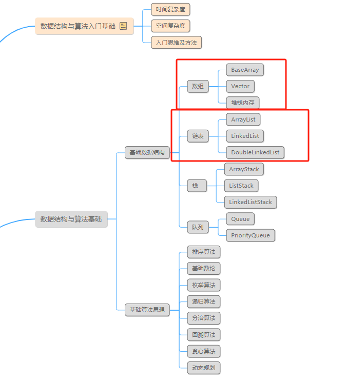
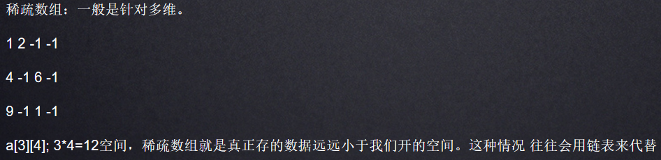
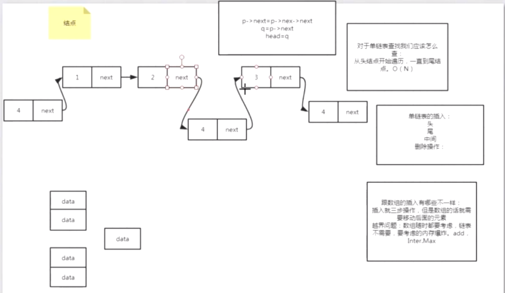
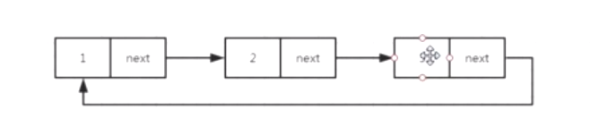
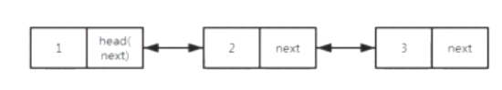
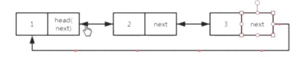
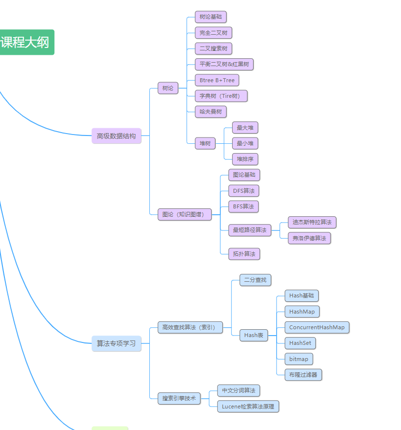

## 稀疏数组

## 链表的定义

链表通过指针将一组零散的内存块串联在一起。
其中，我们把内存块称为链表的“结点”。
为了将所有的结点串起来，
每个链表的结点除了存储数据之外，
还需要记录链上的下一个结点的地址。

## 链表的特点

(1)不需要连续的内存空间。
(2)有指针引用
(3)三种最常见的链表结构：单链表、双向链表和循环链表

## 单链表

从单链表图中，可以发现，有两个结点是比较特殊的，它们分别是第一个结点和最后一个结点。
我们一般把第一个结点叫作头结点，把最后一个结点叫作尾结点。
其中，头结点用来记录链表的基地址。有了它，我们就可以遍历得到整条链表。
而尾结点特殊的地方是：指针不是指向下一个结点，而是指向一个空地址NULL，表示这是链表上最后一个结点。
图：

## 循环链表

循环链表是一种特殊的单链表。实际上，循环链表也很简单，它跟单链表唯一的区别就在尾结点。
我们知道，单链表的尾结点指针指向空地址，表示这就是最后的结点了。
而循环链表的尾结点指针是指向链表的头结点。
从我画的循环链表图中，你应该可以看出来，它像一个环一样首尾相连，所以叫作“循环”链表。

### 双向链表

单向链表只有一个方向，结点只有一个后继指针next指向后面的结点。双向链表，顾名思义，它支持两个方向，每个结点不止有一个后继指针next指向后面的结点，还有一个前驱指针prev指向前面的结点。双向链表需要额外的两个空间来存储后继结点和前驱结点的地址。所以，如果存储同样多的数据，双向链表要比单链表占用更多的内存空间。虽然两个指针比较浪费存储空间，但可以支持双向遍历，这样也带来了双向链表操作的灵活性。那相比单链表，双向链表适合解决哪种问题呢？

Spring AOP 注解，最新的技术，红黑树和链表查找。logn，O（n） JDK1.8 到8的才转红黑树。最适合你的。架构师
B+Tree:Mysql索引 叶子节点 双向链表 -- （最佳运用场景）

双向循环链表

1. 如何设计一个LRU缓存淘汰算法？基础
   最近使用，只需要维护一个有序的单链表就可以了。有序的指的就是加入的时间排序
2. 约瑟夫问题
   约瑟夫问题是个有名的问题：N个人围成一圈，从第一个开始报数，第M个将被杀掉，最后剩下一个，其余人都将被杀掉。例如N=6，M=5，被杀掉的顺序是：5，4，6，2，3，1。
   现在问你最后留下的人是谁？
   比如N=6，M=5
   留下的就是1
   1 2 3 4 5 6 => 6 1 2 3 4 => 6 1 2 3 =>1 2 3 => 1 3 => 1

